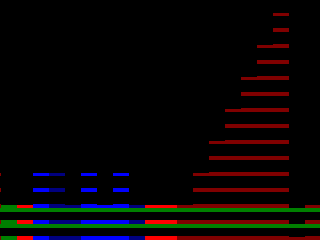
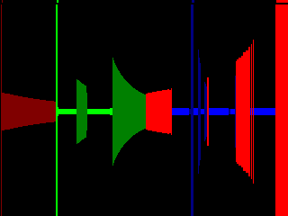
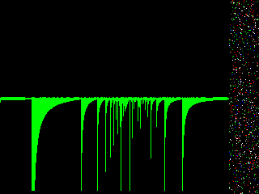
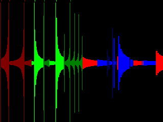
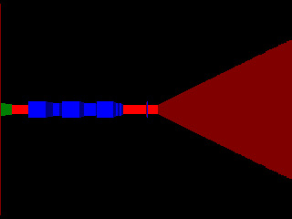

# Classic raycasting engine on FPGA

A partially functional wolf3D style "GPU" in verilog. Designed to be driven by
an arduino over a serial protocol (PC over USB works too).

Demonstration: https://youtu.be/cK2yZqbM3D0 (~20fps)

Hardware: "Mojo v3" FPGA hobbyist board, containing a xilinx spartan-6 XC6SLX9
FPGA. Attached to a [2.2 inch SPI LCD](https://www.adafruit.com/product/1480)
running at 320x240 in 16bit color.

About half of the logic is used; though the sprite code hasn't been area
optimized yet. Built with Xilinx's EOL'ed ISE monstrosity.

## Motivation

Relink this somewhere else later.

## Implementation Notes

The algorithm is based off of the famous [lodev
tutorial](https://lodev.org/cgtutor/raycasting.html) on raycasting engines. It
casts walls, floors, ceilings, and sprites are starting to work.

It's broken down into several high level modules:

* A memory mapped protocol handler, used over serial (via USB for now)
* A ray casting module (single cycle DDA tests!)
* A line drawer module (walls/floors/ceilings/sprites)
* A sprite metadata transformation module
  * Along with a per-scanline sprite sorter
* An SPI LCD driver

Textures are 32x32 with 4-bit color. Initially I went for a VGA style, but
the LCD forces me to ship 16 bits per pixel no matter what. Instead, I gave
each texture/sprite an individual 15 color palette, which looks pretty good.

The biggest gotcha with this whole thing is that the FPGA doesn't have enough
memory for a full frame buffer at 320x240, or 320x200 even. Usually FPGA's are
great at "racing the beam", where you just wire up a VGA signal and make sure
pixels exist at the time they're needed.

Which would be great, but a ray casting algorithm uses vertical lines, not
horizontal ones. So I took some liberties and used a highly configurable SPI
LCD. The LCD acts like a sort-of framebuffer, as it holds the most recent
image and you can update specific regions of the screen if desired.

FPGA's can run any amount of logic in parallel. Every bit of hardware unused
during a cycle is technically a waste. Though this engine is light years away
from being that efficient, it does a lot of work in parallel: the ray caster,
the line drawer, and the screen blitter.

The next ray is cast while a line is drawn. The previous line
is written to the LCD while the next one is drawn. This allows a lot more work
to be done than a normal microcontroller.

Fixed point math is used extensively. In starting this project I had no real
idea of how much logic the 7k LUT's would afford me, so I went with a
conservative Q8.8 (16bits of total resolution). This looked mostly fine but
turned out to be a mistake once I got to sprites. FPGA's don't care too much
about what your bit lengths mean, so a value more like Q12.12 might work
better.

Fixed point math is [explained thoroughly
here](https://www.allaboutcircuits.com/technical-articles/multiplication-examples-using-the-fixed-point-representation/)
and there is also a good [verilog specific
overview](https://timetoexplore.net/blog/fixed-point-numbers-in-verilog)

There is a (huge!) divider used for part of the ray casting sequence, but in
general division is avoided via inverse lookup tables.

In its current state it can get up to 23fps. 30 should be doable via an
assortment of tricks. 60 would be doable if using an 8-wire parallel
LCD, or if the LCD simply supported dspi or quad spi. As-is, I'm impressed
that it's able to ship over 3.5 megabytes per second over a single little
wire.

## Development Notes

The best thing (to me) about working with graphics is the visualization of
glitches. Worst case: black screen. Middle case: any kind of garbage. Best
case: What you expect to see.

This project took a lot of turns. I'll mostly bullet point the development
notes and expand over time.

* First wrote a reference implementation in golang because I need more
  practice in that language. Took about an hour to get untextured lodev
ported. I then instrumented all of the stages of the math and swapped in
lookup tables where the FPGA would use them. Was able to test ideas and
compare math output with the FPGA simulator for debugging. This would have
turned into a great suite of unit tests, but setting that up is obnoxiously
hard. Sadly the golang is a mess but I might post it later.

* Initially used a 32 megabyte SDRAM chip on an expansion board. Stored lookup
  tables and framebuffers, with the intention of drawing frame A while
blitting frame B. This mostly worked, except certain specific bits were
flipping to zero sometimes. I spent weeks rewriting and rewiring and fiddling
thinking it was a bug of my own doing. Since the SDRAM controller ran at
100mhz while the rest of the design used a 50mhz clock, I went fairly deep
into cross-domain clock issues. In the end I removed the board and changed the
algorithm to operate on scanline and the weird bugs all went away.

* A lot of hard-coded things are intended to be maximum sizes; there's nothing
  enforcing 320x240 besides a bunch of infexible code. Most of the ROMs should
turn into RAMs which get initialized by the arduino and support a resolution
"up to 320 by something".

* Q8.8 fixed point worked okay, but some things (distance calculation, sprites) need at
  least 12 bits of resolution on the left or right side. I've written the
sprite code upscaling to Q16.16, but multiplying two Q16.16's requires
chaining through 3 DSP's. Experimenting with Q12.12-ish numbers might find a
better middleground.

* I blame some residual visual glitches on Q8.8 - unsmooth changes in height,
  seemingly overflows in floors/ceilings at certain angles or distances which
makes them look off.

* The Q8.8's were also around from when the SDRAM was going to host lookup
  tables in the hundreds of kilobytes. 4 bytes were written or read at a time,
so two 16bits fit nicely but multiple Q12.12's are awkward.

* It's fine for any of the ROMs to contain numerics in a subset of Q12.12 (ie;
  Q4.12, Q8.0, etc), but the ROM's should return the primary fixed point size
when queried.

* The Q16.16 upconversion was easy until it met a negative number. I'll let
  you figure out what I did wrong.

* It's psychotic how hard it is to write a unit test! You can write test
  benches and use a simulator, which I relied on heavily but late in the process.
There are ways to run the tooling on the commandline and dump printed output,
which I can then wrap in unit tests and run through ranges of data. Trying
harder to get this working would've saved me a *lot* of time over the project.
At this point it's something I'll attempt with newer tooling (vivado, OSS
stuff).

* Integration tests as well! I got pretty good at running the simulator over
  specific modules, but had no real tests for the central mmap interface. This
was even harder when the SDRAM chip was in use, since that's not going to
simulate cleanly.

* There are two major branches of raycaster software: lodev's, which uses
  planar projection to avoid fisheye correction or constant cos/sin fiddling.
Then the "Classic", which has sin/cos/tan/atan lookup tables for most possible angles. As soon
as I started decomposing the lodev algorithm to remove divisions, I realized
the classic raycaster has a lot of small tables and is potentially
simpler for an FPGA. In the end I embedded a divider to overcome the loss of a
large angle lookup table.

* I wrote all the code like a software person would. Lots of state machines
  and a few larger-ish modules. The further I got along the better I
understand how thinking at the logic level would change this design. It would
be completely different! I don't know what that is though.

* Using another mojo tutorial, I experimented with using a trivial core and
  some ASM to enable hardware reuse. Every time you specify a multiplier in
verilog, it will either burn one of 16 available DSP's (for the spartan-6), or
create a mess of multiplier wiring in place. Thus roundtripping through
reuable logic can save a lot of LUTs! Except even after optimization the core
used a lot of space on the FPGA. I converted the raycaster to using ASM
for setup/teardown. However the result wasn't
very readable. I'd use a core for more complex designs, but with this one you
can simply open `cast_ray.v` and understand how the whole thing flows.

* Learning verilog is obnoxiosly hard. "Verilog by Example" was a great find
  in helping me bootstrap past the various internet tutorials for hobbyist
boards. Most books on the subject are textbooks, most are very old and very
abstract. Most of the internet tutorials use very different coding styles,
which I had a hard time understanding why they differ.

* At this point, I could take a language spec of verilog and understand the
  rest of it. I could probably also puzzle through most logic design books. It
took a good amount of effort to get here.

## Fixes and Further Work

More bullet points!

* It doesn't yet "feel solid". Walls are okay until you get close; I capped
  the height instead of letting them scale off screen. Floors and ceilings
have either overflows or math bugs for certain angles/distances. There isn't
quite enough resolution for distance -> height mapping, leading to some
jaggies. The textures/sprites are downsampled to 32x32 to save block RAM. I
wouldn't consider this finished unless it looks better. Though from most
angles it looks pretty good.

* Sprites are halfway there. Converting sprites from a framebuffer to scanline
  algo is fairly hard. Most early game consoles do this (NES PPU/etc). They
are starting to work; some X positional swimming when rotating the camera, and
need to implement sorting for the scanline.

* Sprites can take a further optimization: since the maps are small there's
  enough RAM to make a chain bucket hash table out of the sprite metadata. The
raycaster then logs which map squares it examines and the sprite scanline
module simply pulls those in order and sorts sprites which occupy the same square.
Currently it iterates through all possible sprites to figure out what's on
that scanline (though it does this while the line is being drawn)

* I really want to have the sprites drawn in parallel into separate memory;
  however this requires blanking out the line first which will burn cycles.
The blitter can source from two memories in the same cycle, painting from the
wall line if the sprite pixel is the alpha (transparent) pixel.

* Sprites could also be run length encoded similar to how wolf/DOOM actually do it.
  For this FPGA case, I would only RLE for "next N pixels are alpha" or "next N bytes are normal colors".

* Maps aren't dynamically loadable yet ;)

* I discovered some 45mhz quad-spi 8 pin 4mbit SRAM chips (IS62WVS5128GBLL-45NLI). Hooking one of these up would allow streaming textures from the SRAM at draw time, upping back to 64x64.

* Similarly, the arduino could load map/sprite data from an SD card through the
  LCD screen, or an SPI NOR flash chip.

* These are kind of expensive chips ($5 each), 20mhz qspi SRAM's might work as
  well. Could also be used as frame buffers, but they're a bit slow for that.

* I also bought some smaller LCD's which use a slightly different
  controller. It would be fun to run a HUD or automap on an entirely separate
SPI LCD!

* Targetting a framerate of 30fps, driven by the arduino. Optimizing the feed
  to the SPI LCD would get another frame or two. My LCD is 320x240, but the
original wolf3D actually ran at 320x200, with a large status bar at the
bottom! The LCD can be instructed to draw within certain rectangles, which
should allow easily locking 30fps if a decently sized status bar is used.

* I have some parts for sound output but haven't started on it yet.

* Port to the TinyFPGA BX which I recently acquired. Has OSS tooling, but no
  DSP's. Would need a divider, more resource sharing and area optimization,
etc. The unit is a little sparse on pins.

* There's a good amount of resources leftover on the spartan-6 still. Fairly
  confident I could get DOOM working. Maybe I will, maybe some other time :)
